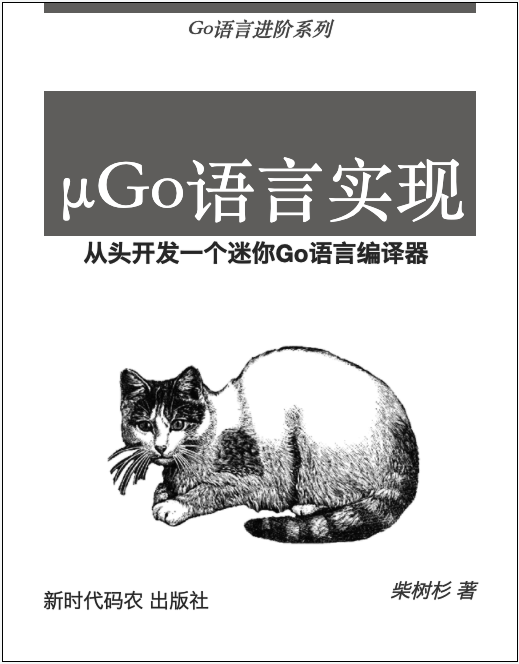

# 《µGo语言实现——从头开发一个迷你Go语言编译器》

- *KusonStack一站式可编程配置技术栈: https://github.com/KusionStack/kusion*
- *KCL配置编程语言: https://github.com/KusionStack/KCLVM*
- *凹语言™: https://github.com/wa-lang/wa*

----

本书尝试以实现 µGo 编译器为线索，以边学习边完善的自举方式实现一个玩具语言。



- 在线阅读(Go版本): https://wa-lang.org/ugo-compiler-book/
- 在线阅读(Rust版本): http://wa-lang.org/ugo-compiler-book/ugo-rust-book
- 示例代码(Go版本): [https://github.com/wa-lang/ugo](https://github.com/wa-lang/ugo) (和章节对应的分支)
- 示例代码(Rust版本): [https://github.com/chai2010/ugo-rs](https://github.com/chai2010/ugo-rs) (和章节对应的分支)
- µGo 输出C语言: https://github.com/3dgen/ugo-c-book
- 社区分享: [Go编译器定制简介](https://wa-lang.org/ugo-compiler-book/talks/go-compiler-intro.html)

---

## What: µGo 例子

```go
package main

import "libc"
import m "libc.math"

const Pi = 3.14
const Pi_2 = Pi * 2

type MyInt int
type MyInt2 = int

var x = println(1 + 2*(3+4) + -10 + double(50))

func println() int

func main() int {}
```

## Output: 输出的目标格式

为了跨平台和方便测试，输出LLVM汇编代码，如果以后可能会增加WASM文件。

## License 版权

学习目的可在 Github 平台免费阅读。
