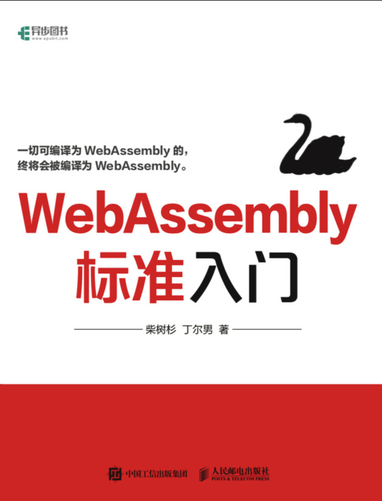

# 4.4 输出WASM模块

我们的后端输出的是LLVM汇编代码。从LLVM-8之后内置了对WebAssembly的支持，因此我们可以借助LLVM工具链产生WASM模块。

WebAssembly的基础知识可以参考作者的《WebAssembly标准入门》：



## 4.4.1 导入Builtin函数

之前是基于C语言构造了Builtin的println和exit函数，在WASM环境我们可以从宿主导入。可以基于Node.js构造宿主需要的函数：

```js
// run_wasm.js
const fs = require('fs');

var wasmInstance = null

WebAssembly.instantiate(
	new Uint8Array(fs.readFileSync('./a.out.wasm')),
	{
		env: {
			ugo_builtin_println: function(n) {
				console.log(n);
				return 0;
			},
			ugo_builtin_exit: function(n) {
				console.log("exit:", n);
				return 0;
			}
		}
	}
).then(result => {
	wasmInstance = result.instance;
	wasmInstance.exports.main();
}).catch(e => {
	console.log(e);
});
```

其中分别定义了ugo_builtin_println和ugo_builtin_exit两个函数。

## 4.4.2 配置WASM工具链

从LLVM-IR到WASM可以通过llc和wasm-ld两个命令完成，这2个文件只有在安装LLVM-8之后的版本才可用。为了方便指定这些工具，main函数新增对应2个参数：

```go
func main() {
	...
	app.Flags = []cli.Flag{
		...
		&cli.StringFlag{Name: "wasm-llc", Value: "", Usage: "set wasm-llc"},
		&cli.StringFlag{Name: "wasm-ld", Value: "", Usage: "set wasm-ld"},
		...
	}
	...
}
```

同时build的参数也增加相应的配置：

```go
package build

type Option struct {
	...
	WasmLLC string
	WasmLD  string
}
```

同样完善在main需要的辅助函数：

```go
func build_Options(c *cli.Context) *build.Option {
	return &build.Option{
		...
		WasmLLC: c.String("wasm-llc"),
		WasmLD:  c.String("wasm-ld"),
	}
}
```

llc和wasm-ld命令就绪后就可以准备后续工作了。

## 4.4.3 配置WASM工具链

改造build包中的`Context.build`方法，增加对wasm的特化处理：

```go
package build

func (p *Context) build(
	filename string, src interface{}, outfile, goos, goarch string,
) (output []byte, err error) {
	...
	if p.opt.GOOS == "wasm" {
		if !strings.HasSuffix(outfile, ".wasm") {
			outfile += ".wasm"
		}

		cmdLLC := exec.Command(
			p.opt.WasmLLC,
			"-march=wasm32",
			"-filetype=obj",
			"-o", _a_out_ll_o,
			_a_out_ll,
		)
		if data, err := cmdLLC.CombinedOutput(); err != nil {
			return data, err
		}

		cmdWasmLD := exec.Command(
			p.opt.WasmLD,
			"--entry=main",
			"--allow-undefined",
			"--export-all",
			_a_out_ll_o,
			"-o", outfile,
		)
		data, err := cmdWasmLD.CombinedOutput()
		return data, err
	}
	...
}
```

基本思路是先用llc产生wasm32平台的obj文件，然后通过wasm-ld将obj文件链接为wasm文件。

## 4.4.4 组装测试

依然是之前的例子(`./_examples/hello.ugo`)：

```go
package main

var x1 int
var x2 int = 134

func main() {
	{
		var x2 = x2
		x2 = x2 + 1000
		println(x2)
	}
	println(x1)
	println(x2)
}
```

作者本地LLVM-9安装在`/usr/local/Cellar`路径，通过以下命令构建wasm模块：

```
$ go run main.go \
	-goos=wasm -debug=true \
	-wasm-llc=/usr/local/Cellar/llvm/9.0.0/bin/llc \
	-wasm-ld=/usr/local/Cellar/llvm/9.0.0/bin/wasm-ld \
	build ./_examples/hello.ugo

```

输出的wasm文件可以用`wasm2wat a.out.wasm`命令查看：

```webassembly
(module
  (type (;0;) (func (param i32) (result i32)))
  (type (;1;) (func))
  (type (;2;) (func (result i32)))
  (type (;3;) (func (param i32 i32) (result i32)))
  (import "env" "ugo_builtin_println" (func $ugo_builtin_println (type 0)))
  (func $__wasm_call_ctors (type 1))
  (func $ugo_main_main (type 2) (result i32)
    (local i32 i32)
    get_global 0
    i32.const 16
    i32.sub
    tee_local 0
    set_global 0
    get_local 0
    i32.const 0
    i32.load offset=1028
    i32.const 1000
    i32.add
    tee_local 1
    i32.store offset=12
    get_local 1
    call $ugo_builtin_println
    drop
    i32.const 0
    i32.load offset=1024
    call $ugo_builtin_println
    drop
    i32.const 0
    i32.load offset=1028
    call $ugo_builtin_println
    drop
    get_local 0
    i32.const 16
    i32.add
    set_global 0
    i32.const 0)
  (func $ugo_main_init (type 2) (result i32)
    i32.const 0
    i32.const 134
    i32.store offset=1028
    i32.const 0
    i32.const 0
    i32.store offset=1024
    i32.const 0)
  (func $__original_main (type 2) (result i32)
    call $ugo_main_init
    drop
    call $ugo_main_main
    drop
    i32.const 0)
  (func $main (type 3) (param i32 i32) (result i32)
    call $__original_main)
  (table (;0;) 1 1 anyfunc)
  (memory (;0;) 2)
  (global (;0;) (mut i32) (i32.const 66576))
  (global (;1;) i32 (i32.const 1032))
  (global (;2;) i32 (i32.const 1024))
  (global (;3;) i32 (i32.const 66576))
  (global (;4;) i32 (i32.const 1024))
  (global (;5;) i32 (i32.const 1028))
  (global (;6;) i32 (i32.const 1024))
  (export "memory" (memory 0))
  (export "__wasm_call_ctors" (func $__wasm_call_ctors))
  (export "__data_end" (global 1))
  (export "__global_base" (global 2))
  (export "__heap_base" (global 3))
  (export "__dso_handle" (global 4))
  (export "ugo_main_main" (func $ugo_main_main))
  (export "ugo_main_x2" (global 5))
  (export "ugo_main_x1" (global 6))
  (export "ugo_main_init" (func $ugo_main_init))
  (export "__original_main" (func $__original_main))
  (export "main" (func $main))
  (data (i32.const 1024) "\00\00\00\00\00\00\00\00"))
```

现在可以通过Node.js执行了：

```
$ node run_wasm.js
1134
0
134
```

输出结果和本地执行一致。
